# **B/B+ Tree**

红黑树，B/B+tree，过滤器都是带查找的数据结构

**二叉树的层高有哪些影响**

- 对比的次数，找下一个节点多
- 如果启动进程./a.out，在内存里面的结构树是想象出来的，

****

**如果存储在磁盘里面，二叉树在查找的时候，磁盘寻址是一个很麻烦的过程所以就衍生出来了降层高的数据结构，不如多叉树**
```
例如：1024个数据，开四叉，层高最低为：log4(1024/3)
```

多叉树不等于B树

## 一颗M阶B树，满足以下条件：
```
1、每个节点有至多拥有M个孩子节点，M-1个关键字
2、根节点至少拥有两颗子树
3、除了根节点以外，其余每个分支节点至少拥有M/2棵子树
4、所有的叶节点都在同一层（平衡因子等于0的多路查找树）
5、有K棵子树的分支节点则存在k-1个关键字，关键字按照递增顺序进行排序
6、关键字数量满足ceil(M/2)-1 <= N <=M-1
```
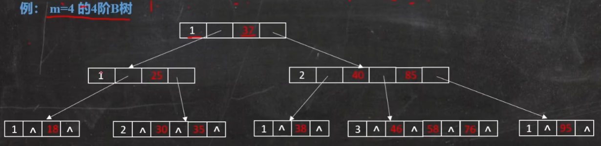

## B树和B+树的区别
```
btree: 所有节点存储数据
b+tree: 叶子节点存储数据，内节点索引用的

使用场景有什么差异：
* 如果数据很多，例如100w个节点，如果使用B树，则当内存写满之后，才会下磁盘，
  也就是说有一部分数据写在内存上，有一部分数据写在磁盘上。
* B+树也会是按照上面的步骤存储，但是内节点不存储数据，只做索引用，所以B+树
  存储在内存里面的索引会比B树的索引多，因此索引更快。
```

## B树添加26字母
### 难点1 节点满了之后要分叉，根节点为父节点，左边插入倒左子树，右边插入到右子树
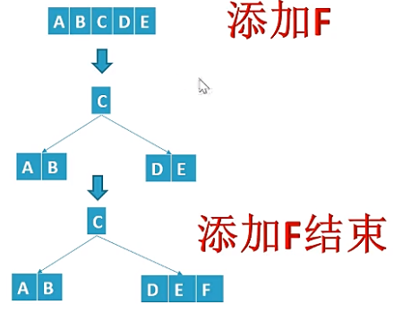

### 难点2 子节点满了之后要分裂，把中间插入到父节点，另外子节点的两端变为父节点的两个子节点
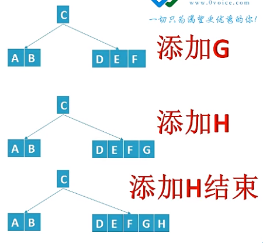
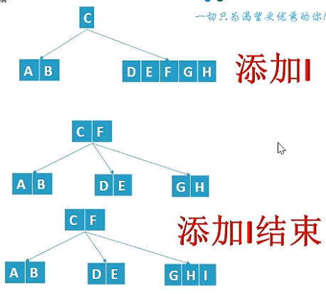

**先分裂再添加**

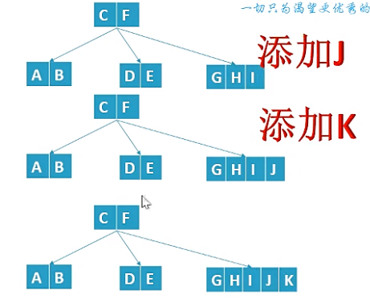
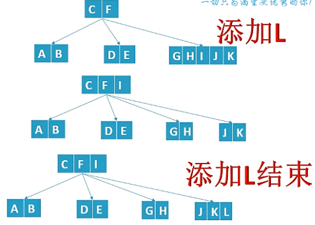
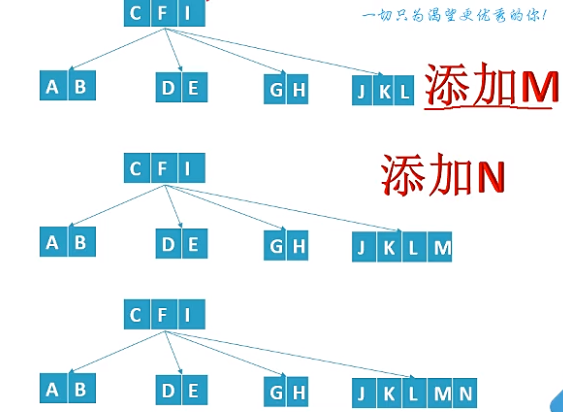
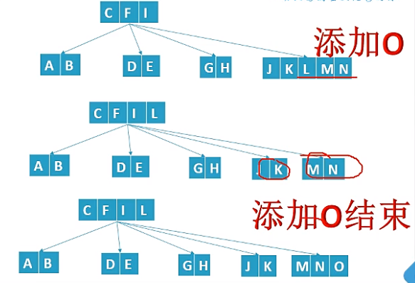
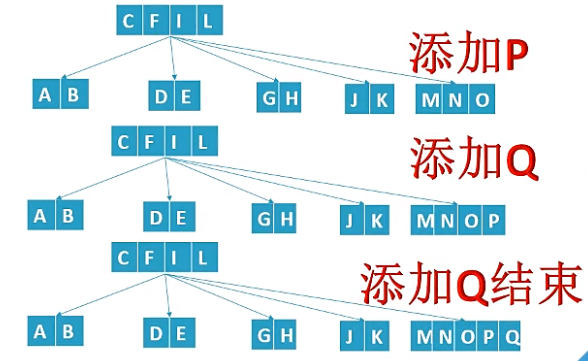
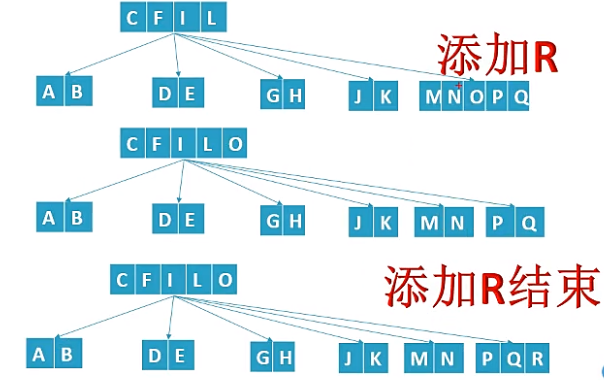

### 难点3 根节点变成5个后继续添加
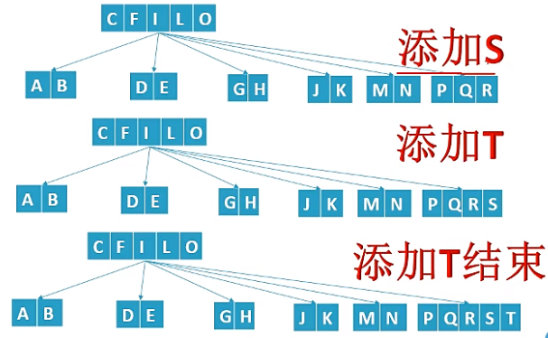
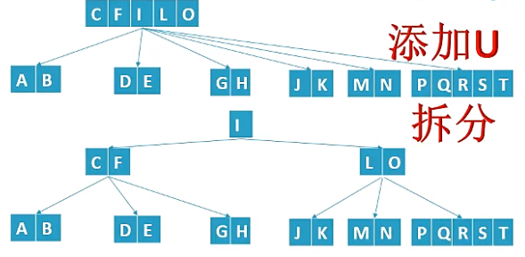

## B树的删除
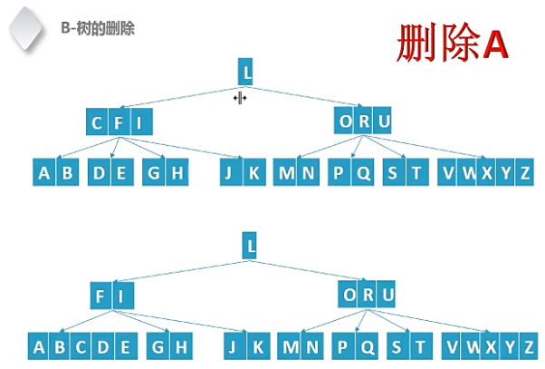

### 难点1 不能直接删除A，因为违背B树的性质：关键字数量大于等于(M/2)-1,上述是6阶，关键字数量最少为2
```
情况1：删除A

把C的第一棵子树和第二棵子树合并，把C推下来合并
再删除A
为什么推下C，因为A是比C小，合并的是C两侧的子树
```
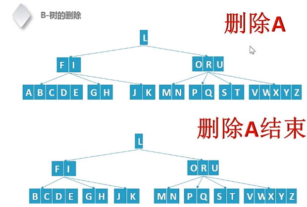

```
情况2：删除B

借位操作
在什么时候借位：
删除的结点的父节点只有最少个数的关键字的时候就需要借位
```
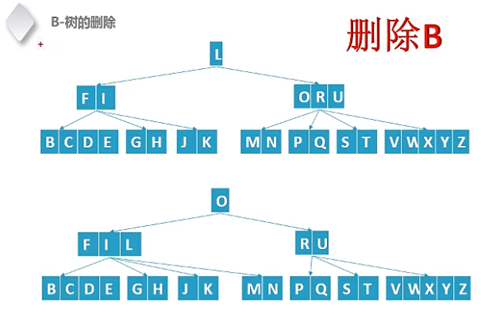

```
情况3：删除E

借位借不到就合并
```
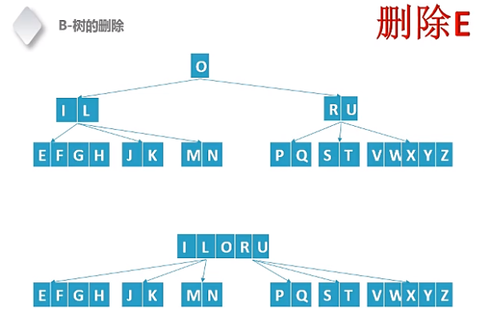

## 之前删除的都是叶子节点，如果要删除内节点如何操作
```
删除O

需要放到叶子节点，再进行删除
```