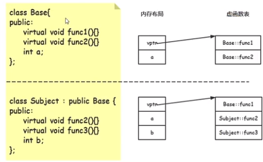
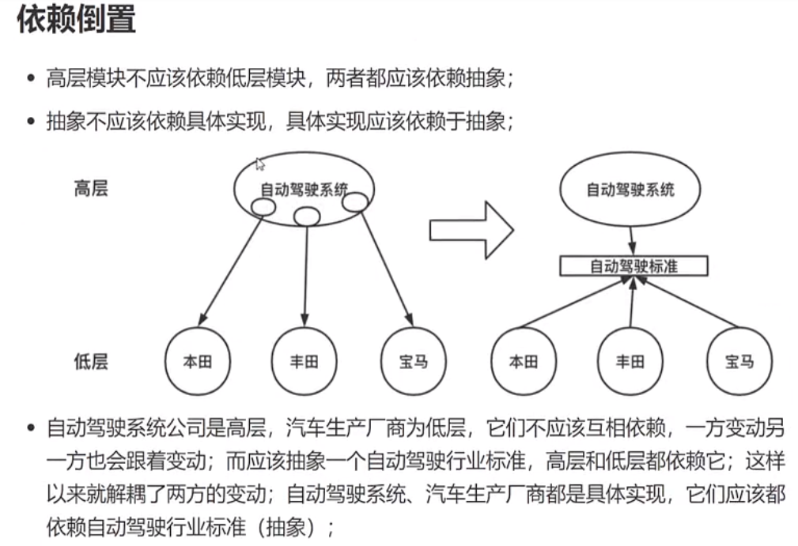

## 设计模式是什么

```
软件开发过程中，经过验证的，用于解决在特定环境下，重复出现的，特定问题的解决方案

解决问题的固定套路

慎用设计模式

提前有一定的工程代码量才能精通
```

## 设计模式是怎么来的
```
满足设计原则之后，慢慢迭代出来的
```
## 设计模式解决了什么问题
```
具体的需求既有稳定点，又有变化点

期望修改少量的代码，就可以适应需求的变化
```
## 设计模式基础
```
面对对象的思想：封装、继承、多态

封装：隐藏实现细节，实现模块坏

继承：无需修改原有类的情况下，通过继承实现对功能的扩展

多态：

静态多态：函数重载

动态多态：继承中虚函数重写
```


```
设计原则

1、依赖倒置

2、开闭原则
对扩展开放，对修改关闭；封装，多态

3、面向接口
封装

4、封装变化点
封装，多态

5、单一职责原则
封装，一个类职责不要太多

6、里氏替换
多态，子类复现的代码要实现代码的职责

7、接口隔离

8、组合优于继承
封装、多态

9、最小知道原则
对类的了解越少越好
```


## 如何学习设计模式

### 明确目的
```
在现有的设计模式基础上，扩展代码

做功能抽象，如何选择设计模式
```
### 学习步骤
```
1、设计模式解决了什么问题
稳定点有哪些
变化点有哪些

2、该设计模式的代码结构是什么

3、符合哪些设计原则
不知道未来如何变化，先选定符合哪些设计原则

4、如何扩展代码
通常应对的是变化点

5、该设计模式有哪些典型应用场景
联系工作场景、开源框架
```

## 模板方法
```
什么是模板方法
定义一个操作中算法的骨架，而将一些步骤延迟到子类中。Template method使得子类可以不改变一个算法的结构即可重定义该算法的某些特定步骤

稳定点：算法骨架
变化点：算法的某些特定步骤
```

## 观察者模式
```
定义：
定义对象间的一种一对多变化的依赖关系，以便当一个对象（Subject）的状态发生改变时，所有依赖于它的对象都能得到通知并自动更新
attach detach 
```

## 策略模式
```
定义：定义一系列算法，把他们一个个封装起来，并且使它们可以互相替换，该模式使得算法可以独立于使用它的客户程序中而变化
```