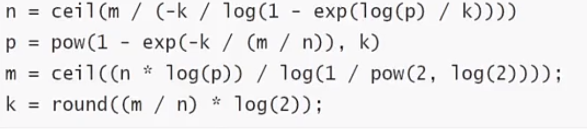
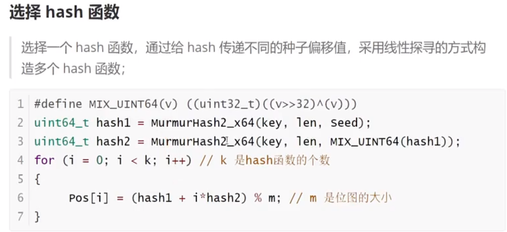

# Hash

## Hash的应用
```
1、hash函数以及冲突处理
2、散列表（哈希表），stl 当中unorderedmap的实现
3、布隆过滤器，后面会有很多地方讲到，例如musql的缓冲方案介绍
4、hyperLoglog，Redis的数据结构，统计相关工作，不会过多介绍
5、分布式一致性hash
```

## 背景
```
1、使用word文档时，word如何判断某个单词是否拼写正确
2、网络爬虫程序，怎么让他不去爬相同的url页面
3、垃圾邮件过滤算法如何设计
4、公安办案时，如何判断某嫌疑人是否在网逃名单中
5、缓存穿透问题如何解决
实际上就是基于某个字符串，在一个大量数据中查询这个字符串是否存在
```

#### 比较平衡二叉树和散列表
```
1、平衡二叉树通过比较，结构有序，提升搜索效率
2、散列表结构无序，主要是key与节点储存位置的映射关系
```

#### 散列表的构成
```
1、hash函数
映射函数 Hash(key)=addr ；hash函数可能会把两个或两个以上的不通key映射到一个地址，这种情况称为冲突（hash碰撞）

2、数组
```

```C
stuct node{
    void *key;
    void *val;
    struct node *next;
}
```

#### 什么时候选择hash
```
1、计算速度快
2、强随机分布
3、murmurhash1速度最快质量一般，murmuehash2中等，murmurhash3计算速度慢质量最好，siphash（redis6.0使用，rust等大多数语言选用的hash算法来实现hashmap，一般是有规律字符串接近的强随机分布），cityhash。
```

## 散列表的操作流程

```
插入和搜索其实是相同的方式

1、先将key通过hash函数生成64位（或32位）的整数，对数组长度取余，key就会落在数组的某个槽位当中。
2、增加节点
```

## hash数组的长度定义多大合适
```
动态增加的过程
1、先定义成4
2、随着节点增加，数组长度不断翻倍
```

## 如何解决hash冲突
```
1、冲突产生的原因
两个节点放在了数组的同一个位置

2、负载因子
描述冲突的激烈程度：数组实际存在的元素个数/数组的长度；

3、解决冲突
3.1、负载因子在合理范围内，使用链表法，当产生冲突用链表链接起来。负载因子<1

3.2、开放寻址法
所有的元素直接放在数组当中，如果产生冲突，不放在原数组位置，通过算法放在其他位置

3.3、防止hash聚集，可以采用双重hash来解决
① Hk(key) = [GetHash(key) + k*(1+(((GetHash(key)>>5)+1)%(hashsize-1)))] % hashsize

② (1+(((GetHash(key)>>5)+1)%(hashsize-1))) 与hashsize互为素数

③ 执行了hashsize次探查后，哈希表中的每一个位置都有且只有一次被访问到，也就是说，对于给定的key,对哈希表的同一位置不会同时使用hi 和 hj
```

## 负载因子不在合理范围内
```
扩容：used > size
缩容：used < 0.1*size
rehash：扩容或者缩容之后需要rehash
```

## stl中的散列表实现
```
unordered_map

unordered_set

unordered_multimap

unordered_multiset
```

## stl底层迭代器
```
将后面的具体节点串成单链表，数组指针指向前一个层的最后一个节点
```

## 布隆过滤器
```
不管是散列表还是平衡二叉树，都保留了key-value值
有时候我们只需要查找key值是否存在，而不需要存储key-value元素

每存入一个key-value就在布隆过滤器当中做个标记，未来就可以判断key是否存在。通常是数据库要做的事情（rocksdb）

不想走服务器网络交互想知道数据库里面是否有key，就可以在服务器部署布隆过滤器，就能查询key是否在数据库中

布隆过滤器解决的问题是：一定可以判断某个文件一定不在布隆过滤器中
```

## 布隆过滤器-构成
```
本质跟散列表相似，但是是通过位图bitmap实现
bitmap也是数组，只有两个状态，0-1
一个byte字节有8个bit比特位，不是0就是1

n个hash函数

vector<char> bitmap;
uint64_t bitmao[];

在C++中可以使用byte buf[8] 来构建64 bit的位图 n = i*8 +j
假设hash[key] = 173
1、173%64 =45
2、j= 45 % 8 =5
3、i = 45 / 8 = 5
```

## 控制布隆过滤器
```
n -- 预期布隆过滤器中元素的个数
p -- 假阳率，在0-1之间 0.000000
m -- 位图所占空间
k -- hash函数的个数
```

[计算参数](https://hur.st/bloomfilter)



## 分布式一致性hash
```
解决问题：分布式缓存当中扩容的问题
1、固定算法、数据迁移
2、hash(key)%2^32
3、保证数据均衡：增加虚拟节点
```