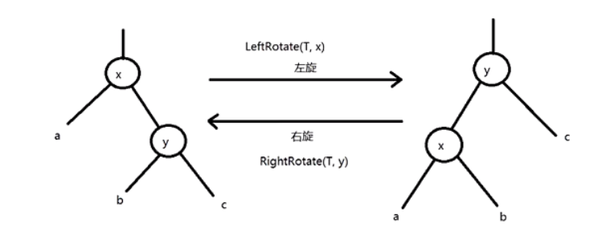
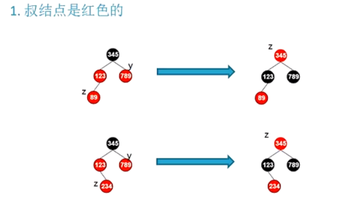
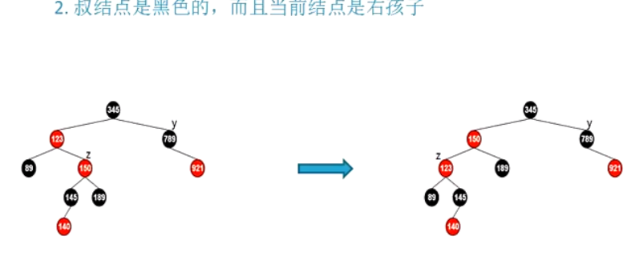
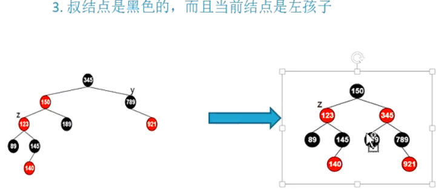

# 红黑树

```
红黑树是一个二叉排序数，顺序执行
红黑树用于哪里?
hashmap、cfs、epoll、定时器、nginx如何用的
```

**强查找的数据结构有：**

1、红黑树

2、hash

3、b/b+ 树

4、跳表

## 什么是红黑树？
1、每个节点是红的或者黑的

2、根节点是黑的

3、每个叶子节点是黑的

4、**如果一个节点是红的，则它的两个儿子都是黑的**

5、对每个节点，从该节点到其子孙节点的所有路径上的包含相同数目的黑节点

## 红黑树节点旋转

```
需要修改三个指针的指向，每个方向两根指针，一共六根指针
X的右子树，Y的左子树，X的Parent
```
## 红黑树节点插入
1、初始上色为红色

**有以下几种情况：**



